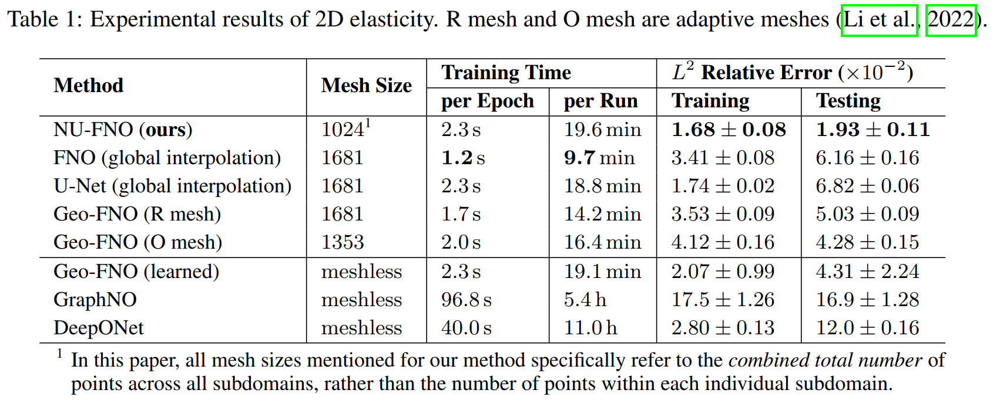

# Non-Uniform Neural Operator (NUNO)

This repository is the official implementation of our [ICML 2023](https://icml.cc/Conferences/2023) paper: [NUNO: A General Framework for Learning Parametric PDEs with Non-Uniform Data](https://arxiv.org/abs/2305.18694). [Here](assets/slides.pdf) are the corresponding introductory slides.

The neural operator has emerged as a powerful tool in learning mappings between function spaces in PDEs. However, when faced with real-world physical data, which are often highly non-uniformly distributed, it is challenging to use mesh-based techniques such as the FFT. To address this, we introduce the Non-Uniform Neural Operator (NUNO), a comprehensive framework designed for efficient operator learning with non-uniform data. Leveraging a K-D tree-based domain decomposition, we transform non-uniform data into uniform grids while effectively controlling interpolation error, thereby paralleling the speed and accuracy of learning from non-uniform data. We conduct extensive experiments on 2D elasticity, (2+1)D channel flow, and a 3D multi-physics heatsink, which, to our knowledge, marks a novel exploration into **3D PDE problems** with **complex geometries**. Our framework has reduced error rates by up to **60%** and enhanced training speeds by **2x** to **30x**. The code is now available at [this https URL](https://github.com/thu-ml/NUNO).

If you find this work is helpful for your research, please **cite us** with the following BibTeX entry:

```
@article{liu2023nuno,
  title={NUNO: A General Framework for Learning Parametric PDEs with Non-Uniform Data},
  author={Liu, Songming and Hao, Zhongkai and Ying, Chengyang and Su, Hang and Cheng, Ze and Zhu, Jun},
  journal={arXiv preprint arXiv:2305.18694},
  year={2023}
}
```

## Directory Structure

This repository is organized as below:

- `data` (folder for training and testing data)
  - `channel` ((2+1)D Channel Flow)
  - `elasticity` (2D Elasticity)
  - `heatsink` (3D Heatsink)
- `src` (folder for scripts to run experiments)
  - `channel` ((2+1)D Channel Flow)
    Note: each Python file corresponds to a single baseline method.
    - `deeponet.py` (to run DeepONet)
    - ...
    - `ours_nuunet.py` (to run one of our methods, NU-U-Net)
  - `elasticity` (2D Elasticity)
    - ...
  - `heatsink` (3D Heatsink)
    - ...
  - `kd_tree` (module of K-D tree algorithm, imported by the above scripts)
- `util` (folder for util functions)
- `assets` (folder for figures and slides)
- `README.md` (this readme)

## Getting Started

1. Install necessary dependencies

    Python 3.10.8

    ```
    matplotlib==3.6.2
    scikit-learn==1.2.0
    torch==1.13.0
    tqdm==4.64.1
    ```

    For most experiments, you only need to install the **above four** libraries. 

    Some (not all) baselines may also require the following libraries:

    - `torch-geometric==2.2.0` (visit [this repo](https://github.com/pyg-team/pytorch_geometric) to install the library)
      - It is required by GraphNO. If you do no run this baseline, you can ignore this library.
    - `sympy==1.11.1`
      - It is required by MWNO. If you do no run this baseline, you can ignore this library.

2. Download datasets

    For **2D Elasticity**, we refer to [this drive](https://drive.google.com/drive/folders/1cznHmQO-hB_VlWOfh7IFpjsPVOYyghGJ).

    Download all the files in folders `Interp`, `Meshes`, `Omesh`, and `Rmesh`. Then put them into the folder `data/elasticity` in *this* repo (**directly move** **`.npy`** **files** but not persevering the original folder structure).

    For **(2+1)D Channel Flow** and **3D Heatsink**, we refer to [this drive](https://1drv.ms/u/s!ApNDtoKtGVC6k6AK3AYprkxiZW0qWA?e=7De5vc).

    Download all the files in `NUNO/ChannelFlow` and `NUNO/Heatsink`, then put them into `data/channel` and `data/heatsink` in *this* repo, respectively (again, **directly move `.npy` files** but not persevering the original folder structure).

3. Run experiments
    ```bash
    # In the root directory of this repository
    
    # To run baselines for 2D Elasticity
    python -m src.elasticity.ours_nufno
    # or one of other baselines...
    # The file name (in src/elasticity) should be able to represent the baseline method corresponding to the script.
    python -m src.elasticity.geofno
    
    # To run scripts in (2+1)D Channel Flow
    python -m src.channel.ours_nufno
    # or one of other baselines...
    
    # To run scripts in 3D Heatsink
    python -m src.heatsink.ours_nufno
    # or one of other baselines...
    ```

## Experimental Results

### 2D Elasticity




### (2+1)D Channel Flow


Note: "oversampling ratio" is a measure for the mesh size.


### 3D Heatsink


